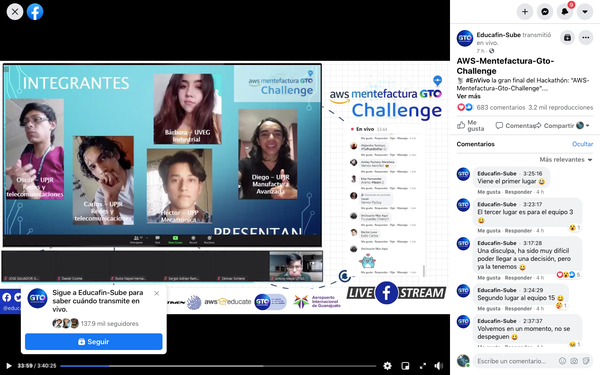

# amazonaws
## 22-03-2021
## Equipo ganador del hackathón "AWS MetefacturaGTO Challenge"
```
El fin de semana se llevó a cabo el Hackathon AWS MENTEFACTURA GTO CHALLENGE en el cual el equipo de "El Garage de Turing" de esta casa de estudios obtuvo el 1er lugar.
Muchas Felicidades a las y los estudiantes de la Ingeniería en Redes y Telecomunicaciones y de la Ingeniería en Manufactura Avanzada, así como al Profesor Luis Rey Lara González por su participación en este gran proyecto.
```

